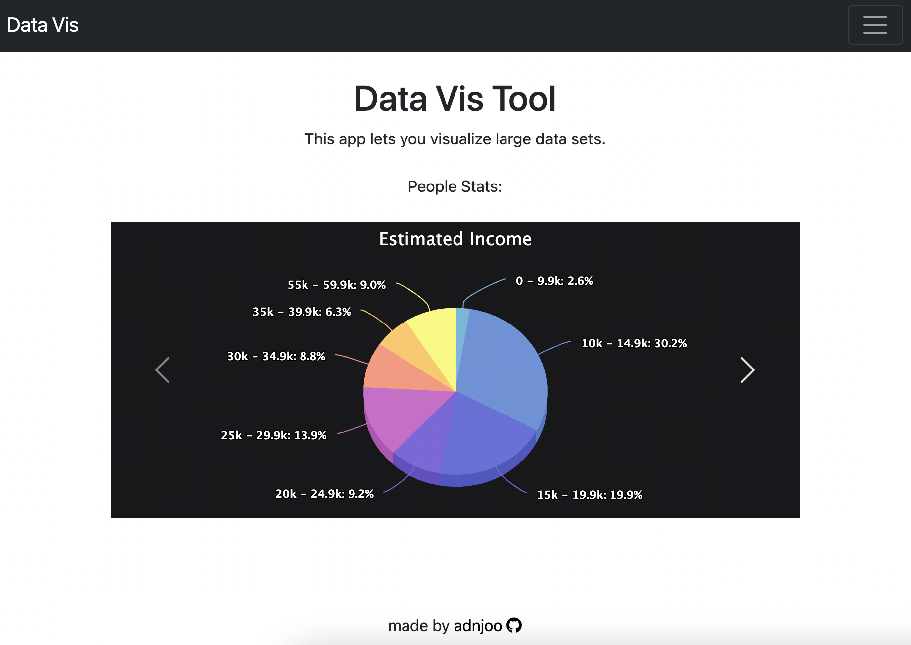

# data-vis-ruby

> Ruby on Rails data visualization tool

[](https://data-vis-ruby.herokuapp.com/)

## Install:

```
git clone https://github.com/adnjoo/data-viz-ruby
cd data-vis-ruby
bundle i
yarn install
rails s
```

## Tech Stack:

- Ruby on Rails

- Postgres (database)

- Chartkick (Highcharts)

- Bootstrap (styling)

- Heroku (deployment)
